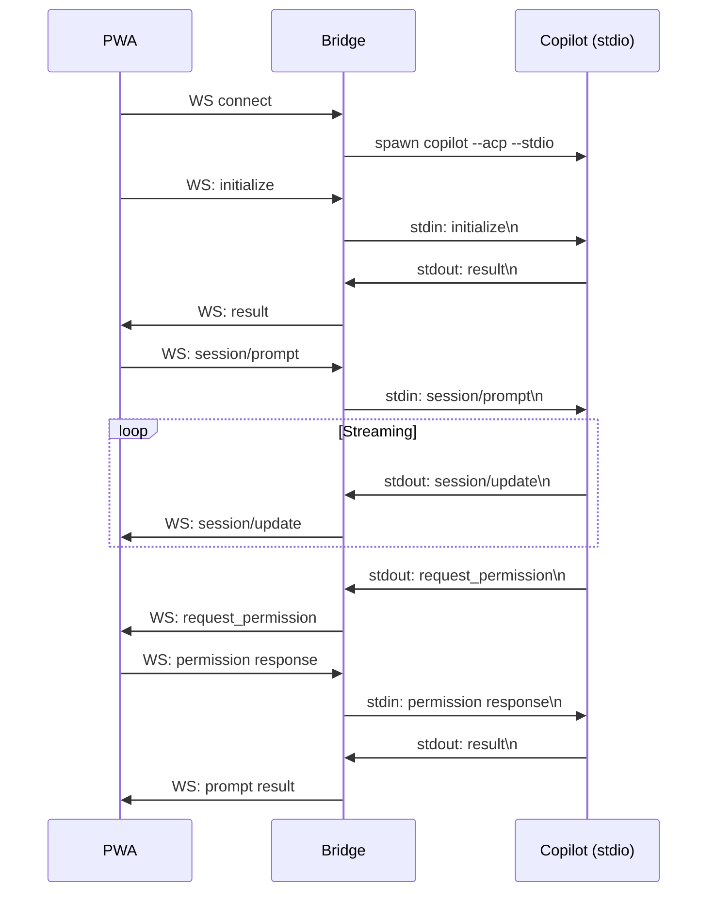

# Architecture

This document describes the internal architecture of Copilot Uplink: how the components connect,
how the bridge lifecycle works, and how the system handles reconnection and session resume.

## System Overview

```
┌──────────────┐       WebSocket        ┌──────────────┐       stdio/NDJSON      ┌──────────────┐
│  PWA Client  │◄─────────────────────►│ Bridge Server │◄──────────────────────►│  Copilot CLI  │
│  (browser)   │       (JSON-RPC)       │  (Node.js)   │    (child process)     │  (--acp)      │
└──────────────┘                        └──────────────┘                        └──────────────┘
```

Three components form a pipeline:

1. **PWA Client** — Preact single-page app running in the browser. Drives the ACP protocol,
   renders streaming responses, tool calls, permissions, and plans.
2. **Bridge Server** — Express + WebSocket server. Spawns the Copilot CLI as a child process
   and forwards messages between WebSocket and stdin/stdout. Mostly a dumb pipe with a few
   targeted interceptions.
3. **Copilot CLI** — GitHub's `copilot --acp --stdio` binary. Speaks JSON-RPC 2.0 over
   newline-delimited JSON (NDJSON).

## The Bridge (Dumb Pipe)

The bridge **intentionally does not parse ACP messages**. It reads newline-delimited JSON from
the subprocess stdout and sends each line as a WebSocket text message; in the other direction it
writes incoming WebSocket messages to stdin with a trailing `\n`.

Benefits:

- **Simple** — the bridge is ~100 lines of logic, easy to audit.
- **Testable** — you can verify framing without any ACP knowledge.
- **Protocol-agnostic** — if ACP evolves, only the PWA client needs updating.

### Server-Side Interceptions

The bridge server intercepts a small number of messages for operational reasons:

| Interception | Why |
|---|---|
| `initialize` request | Served from cache (eager init). Client never waits for cold start. |
| `session/new` response | Records the session ID for history/resume features. |
| `uplink/shell` request | Handled server-side (executes shell commands in cwd). |
| `uplink/rename_session` request | Handled server-side (updates session DB). |

All other messages pass through unmodified.

## ACP Protocol

The [Agent Client Protocol](https://agentclientprotocol.com) defines how AI-powered tools
communicate with host applications. The wire format is JSON-RPC 2.0 delimited by newlines (NDJSON).

Key message types the PWA handles:

| Method | Direction | Purpose |
|---|---|---|
| `initialize` | Client → Agent | Negotiate capabilities |
| `session/new` | Client → Agent | Create a conversation session |
| `session/load` | Client → Agent | Load an existing session (replays history) |
| `session/prompt` | Client → Agent | Send a user prompt |
| `session/update` | Agent → Client | Streaming chunks, tool calls, plan updates |
| `session/request_permission` | Agent → Client | Ask user to approve a tool action |
| `session/cancel` | Client → Agent | Cancel a running prompt |

## Bridge Lifecycle

### Cold Start (First Connection)

```
1. CLI starts             → Bridge spawns `copilot --acp --stdio`
2. Eager initialize       → Bridge immediately sends `initialize` (before any client connects)
3. Client connects        → WebSocket opened
4. Client sends init      → Bridge returns cached initialize result (0ms)
5. Client sends session/* → Forwarded to CLI normally
```

**Eager initialization** overlaps the CLI's cold start (~10-30s) with the time the user spends
opening a browser or scanning a QR code. By the time the client connects, the initialize response
is already cached.

### Reconnection (Page Refresh / Mobile Resume)

```
1. Client disconnects     → Bridge stays alive (NOT killed)
2. Client reconnects      → New WebSocket, same bridge process
3. Client sends init      → Served from cache (0ms)
4. Client sends session/load → See "Session Resume" below
```

The bridge process intentionally survives client disconnections. This means:
- No cold start penalty on reconnect
- The Copilot CLI session remains active in memory
- `session/load` for the same session returns "already loaded" (see below)

### Bridge Death

If the Copilot CLI process exits unexpectedly:
1. Bridge detects `close` event
2. Next client message triggers `ensureBridge()` which spawns a fresh process
3. New eager init is sent immediately
4. Client experiences a brief "initializing" state

## Session Resume

Session resume handles the case where a user refreshes the page (or a mobile browser suspends
and resumes the app). The goal: show the conversation history without a cold start.

### The "Already Loaded" Problem

When the bridge stays alive across reconnections, `session/load` for the same session returns
an error:

```json
{"error": {"code": -32602, "message": "Session X is already loaded"}}
```

This is because the CLI still has the session loaded in memory. Unlike loading a *different*
session (which triggers full history replay via `session/update` notifications), reloading the
*same* session is rejected.

### Solution: Server-Side Session Buffer

The server keeps an in-memory buffer of the active session's `session/update` messages plus
synthesized `user_message_chunk` entries from outgoing `session/prompt` calls. When a client
sends `session/load` for the already-active session:

1. The server intercepts the request (does NOT forward to the CLI).
2. It fabricates a success response with the cached session result.
3. It replays all buffered history lines to the client.

The client never sees the "already loaded" error — it receives the same message flow as a
normal `session/load`. The `onSessionUpdate` handler renders messages identically whether
they come from a live stream or a replay.

The buffer is cleared when:
- The client loads a **different** session (buffer resets for the new session)
- The bridge process dies and restarts (buffer lost; `session/load` triggers fresh ACP replay)

### Session Change Flow

When switching to a *different* session (via session picker or `/session load`):
1. The server clears the buffer and forwards the request to the CLI
2. The CLI unloads the current session, loads the new one, and replays full history
   as `user_message_chunk` and `agent_message_chunk` notifications
3. The server captures these notifications into the new buffer
4. The client renders the replayed history normally

## Logging

The server uses the [`debug`](https://www.npmjs.com/package/debug) package for structured
logging with zero cost when disabled.

### Namespaces

| Namespace | What it logs |
|---|---|
| `uplink:server` | Connection events, WebSocket lifecycle |
| `uplink:bridge` | Bridge spawn, close, errors, stdin/stdout |
| `uplink:session` | Session recording, eager init lifecycle |
| `uplink:timing` | Performance measurements (bridge spawn, initialize, etc.) |

### Enabling

```bash
# Via environment variable
DEBUG=uplink:* npx @mattkotsenas/uplink@latest

# Via CLI flag
npx @mattkotsenas/uplink@latest --verbose

# Specific namespaces only
DEBUG=uplink:timing npx @mattkotsenas/uplink@latest
```

## Message Flow


