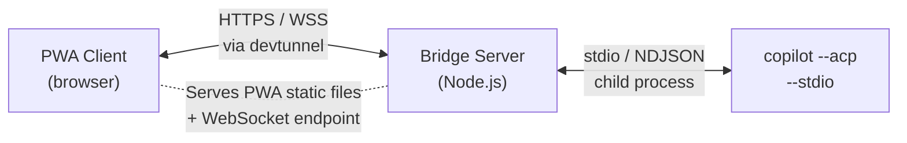

#  Copilot Uplink

**Remote control for GitHub Copilot CLI from your phone or any browser.**

[](https://github.com/MattKotsenas/uplink/actions)
[](https://www.npmjs.com/package/@mattkotsenas/uplink)
[](LICENSE)

## Quick Start

```bash
cd ~/your/project/

# With remote access via devtunnel
npx @mattkotsenas/uplink@latest --tunnel
```

## What Is This?

Copilot Uplink gives you a full chat interface to GitHub Copilot CLI from your phone, a tablet, or any browser.

A lightweight Node.js bridge spawns `copilot --acp --stdio` as a child process, translates between WebSocket and NDJSON
(the ACP wire format), and serves a Progressive Web App that renders streaming responses, tool calls, permissions, and
agent plans. Add a Microsoft Dev Tunnel and the whole thing is reachable from anywhere.



## Features

- 💬 **Chat** with streaming responses
- 🔧 **Tool call visibility** — see reads, edits, executes, and more with kind icons and status
- 🔐 **Permission approve / deny** — surface permission requests with option buttons
- 📋 **Agent plan tracking** — view plan entries with priority and status
- 📱 **PWA** — installable on your phone's home screen
- 🌐 **Remote access** via Microsoft Dev Tunnel
- 🔄 **Auto-reconnect** with exponential backoff (1 s → 30 s max)
- 🌙 **Dark / light theme**

<p align="center">
  
</p>

## Installing Dev Tunnels

Dev Tunnels are required for remote access (`--tunnel`). Install for your platform:

### macOS

```bash
brew install --cask devtunnel
```

### Linux

```bash
curl -sL https://aka.ms/DevTunnelCliInstall | bash
```

### Windows

```powershell
winget install Microsoft.devtunnel
```

After installing, authenticate once:

```bash
devtunnel user login
```

## Getting the PWA on Your Phone

1. **Start with tunnel:**
   ```bash
   npx @mattkotsenas/uplink@latest --tunnel
   ```
2. **Scan the QR code** printed in your terminal with your phone's camera.
3. **Add to Home Screen** — your browser will offer an "Install" or "Add to Home Screen" prompt because the app ships a
   Web App Manifest and Service Worker.

The tunnel URL is **stable per project** — Uplink derives a deterministic tunnel name from your working directory and
reuses it on every run. The installed PWA always connects to the same URL. If the bridge is offline the cached app shell
still opens instantly; it shows a reconnection banner and retries automatically.

> **Tip:** Use `--tunnel-id <name>` if you need explicit control over the tunnel name (e.g., sharing across machines).

## CLI Reference

```
npx @mattkotsenas/uplink@latest [options]
```

| Flag | Description | Default |
|---|---|---|
| `--port <n>` | Port for the bridge server | random |
| `--tunnel` | Start a devtunnel for remote access (auto-persistent per project) | off |
| `--no-tunnel` | Explicitly disable tunnel | — |
| `--tunnel-id <name>` | Use a specific devtunnel name (implies `--tunnel`) | — |
| `--allow-anonymous` | Allow anonymous tunnel access (no GitHub auth) | off |
| `--cwd <path>` | Working directory for the Copilot subprocess | current dir |
| `--help` | Show help and exit | — |

## Contributing

See [CONTRIBUTING.md](CONTRIBUTING.md) for development setup, build, and testing instructions.

## How It Works

1. **Copilot CLI** runs locally in ACP mode (`copilot --acp --stdio`), speaking newline-delimited JSON-RPC over
   stdin/stdout.
2. **Bridge server** spawns the CLI as a child process and bridges messages between its stdin/stdout and a WebSocket
   endpoint.
3. **PWA** connects over WebSocket, drives the full ACP lifecycle (`initialize` → `session/new` → `session/prompt`), and
   renders the streaming response.
4. **Dev Tunnel** (optional) exposes the bridge server over HTTPS so you can reach it from your phone or any remote
   browser.

For detailed architecture documentation — including bridge lifecycle, eager initialization, session resume, and
logging — see [ARCHITECTURE.md](ARCHITECTURE.md).

## Limitations (v1)

- **Single session only** — one browser client at a time.
- **No file system / terminal proxying** — the PWA does not provide client-side FS or terminal capabilities back to the
   agent.
- **No authentication** beyond devtunnel's built-in defaults.

## Roadmap Ideas

- Multi-session support (multiple browser tabs / devices)
- File explorer integration
- Push notifications for long-running tasks
- Syntax-highlighted diffs in tool call output
